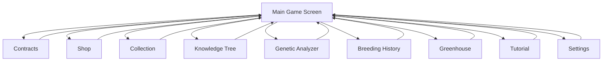
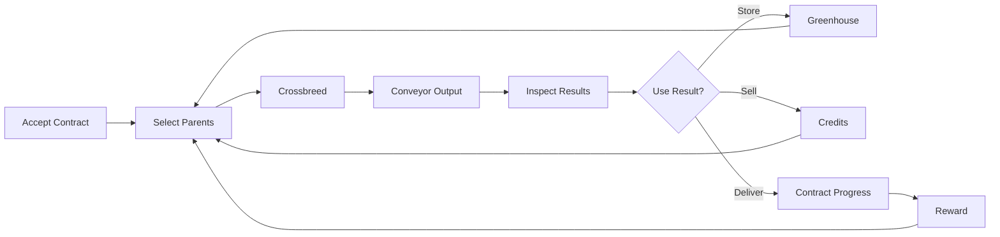

# Navigation Flow

## Input Model

Navigation is mouse-first. The player should primarily move through screens by clicking icon buttons, tabs, cards, and panel controls.

Keyboard navigation must remain available for accessibility and power users. Every screen transition available by mouse must also be reachable through keyboard focus and activation.

Keyboard shortcuts may be added for common actions, but they must not replace visible mouse controls.

## Hub Structure

```text
Main Game Screen
|- Contracts
|- Shop
|- Collection
|- Knowledge Tree
|- Genetic Analyzer
|- Breeding History
|- Greenhouse
|- Tutorial
`- Settings
```

## Mermaid Overview



## Primary Gameplay Flow

```text
Contracts
-> Accept Contract
-> Main Game Screen
-> Select Parent A
-> Select Parent B
-> Start Crossbreeding
-> Production Conveyor
-> Inspect Offspring
-> Store, Sell, or Deliver
-> Reward / Discovery / Upgrade
-> Main Game Screen
```



## Analyzer Flow

```text
Plant or Parent Pair
-> Genetic Analyzer
-> Level-Gated Information
-> Genotype / Probability / Simulation
-> Return to Planning
```

## Collection Flow

```text
Collection
-> Species
-> Phenotypes
-> Genotypes
-> Specimens
-> Entry Detail
-> Back to Collection
```

## Knowledge Tree Flow

```text
Knowledge Tree
-> Select Concept Node
-> Read Explanation / Conditions / Example
-> Related Specimen, Cross, or Contract
-> Back to Knowledge Tree
```

## Shop Flow

```text
Shop
-> Greenhouse Slots
-> Analyzer Upgrades
-> Species Unlocks
-> Confirm Purchase
-> Updated Progression
```

## Overlay Flow

Overlays appear above the current screen and return the player to the prior context after dismissal.

```text
New Discovery
Contract Complete
Species Unlock
Analyzer Upgrade
Reward Received
```
